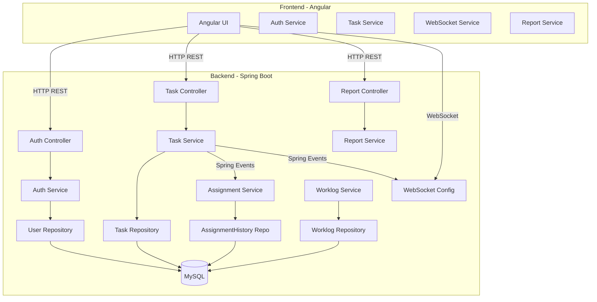
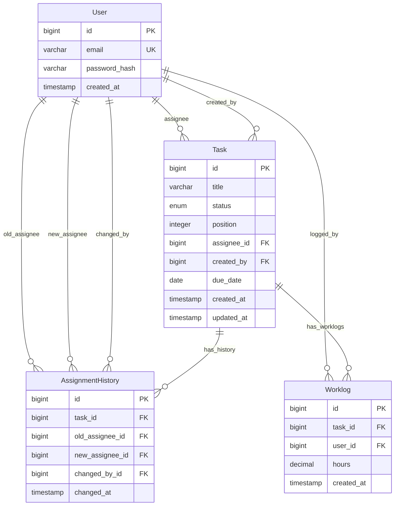
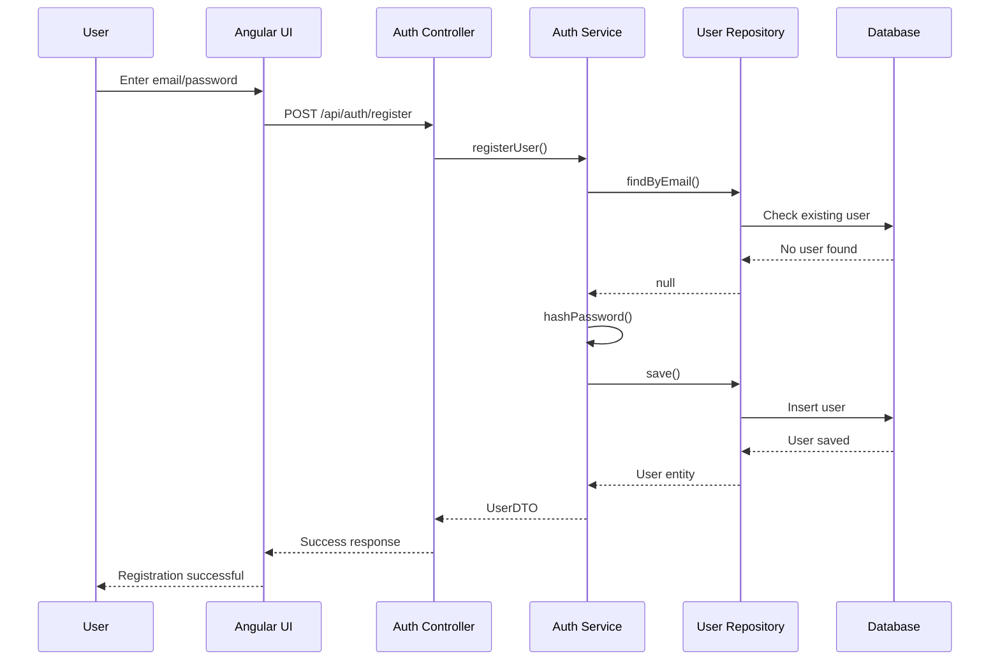
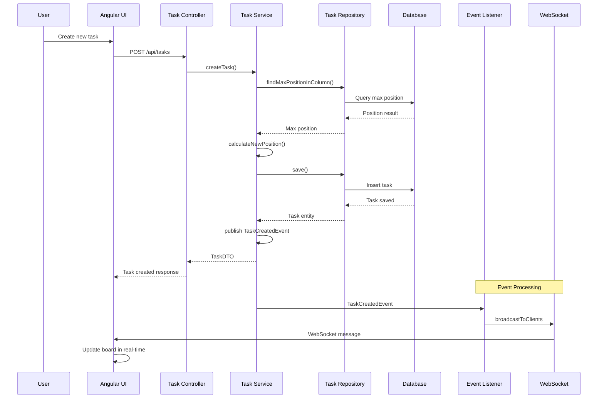
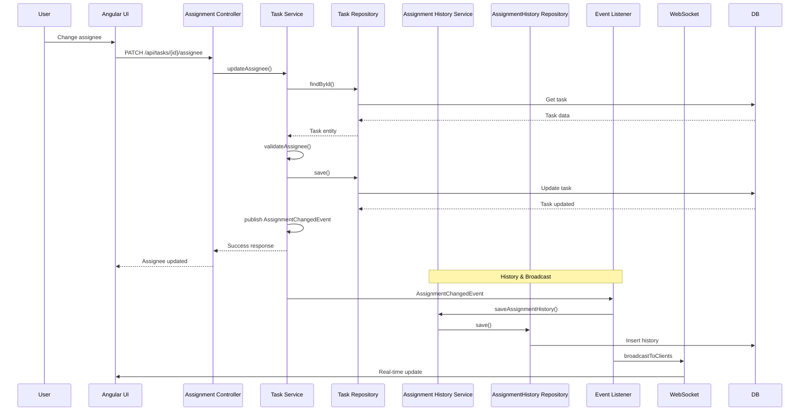

# VibeFlow Kanban Board - Implementation Plan

## System Architecture Diagram



## Database Schema Diagram



## Workflow Diagrams

### 1. User Registration & Authentication Flow



### 2. Task Creation & Real-time Update Flow



### 3. Assignment Update with History Tracking



## Module Implementation Sequence

### Phase 1: Backend Foundation (Week 1)
1. **Project Setup**
   - Spring Boot 3.x.x with Java 17
   - Maven dependencies (Spring Web, Data JPA, Security, WebSocket)
   - MySQL driver
   - Project structure creation

2. **Authentication Module**
   - User entity with JPA annotations
   - UserRepository interface
   - AuthService with password hashing (bcrypt)
   - JWT token generation & validation
   - Spring Security configuration
   - AuthController with register/login endpoints

3. **Common Components**
   - Global exception handler
   - Custom exceptions (ValidationException, NotFoundException)
   - Response DTOs
   - TaskStatus enum
   - Mapper classes (Entity ↔ DTO)

### Phase 2: Core Functionality (Week 2)
4. **User Module**
   - UserController with GET /api/users
   - UserService for user retrieval
   - UserDTO for assignment dropdown

5. **Task Module**
   - Task entity with relationships
   - TaskRepository with custom queries
   - TaskService with business logic
   - TaskController with CRUD operations
   - Validation: title max 255 characters

6. **Board Module**
   - BoardController with GET /api/board
   - BoardService to aggregate tasks by status
   - Column DTOs for frontend display

### Phase 3: Advanced Features (Week 3)
7. **Assignment Module**
   - AssignmentHistory entity
   - AssignmentService with history tracking
   - AssignmentController for assignee updates
   - Spring Event for assignment changes

8. **Worklog Module**
   - Worklog entity (immutable)
   - WorklogService with validation
   - WorklogController for time logging
   - Immutability enforcement

9. **Report Module**
   - ReportService with aggregation queries
   - ReportController for time reports
   - SQL aggregation for total hours

### Phase 4: Real-time & Integration (Week 4)
10. **WebSocket Module**
    - WebSocket configuration
    - STOMP message broker
    - Event listeners for broadcasting
    - Message DTOs for real-time updates

11. **Testing**
    - Unit tests for services
    - Integration tests for controllers
    - Test coverage >90%
    - Mock WebSocket testing

12. **Documentation & Deployment**
    - SpringDoc OpenAPI configuration
    - Dockerfile & docker-compose.yml
    - README with setup instructions
    - Environment configuration

### Phase 5: Frontend Development (Week 5-6)
13. **Angular Project Setup**
    - Angular CLI project
    - Angular Material integration
    - Project structure
    - Routing configuration

14. **Authentication UI**
    - Login component
    - Register component
    - Auth guard
    - JWT interceptor

15. **Board UI**
    - Kanban board component
    - Column components (8 columns)
    - Task card component
    - Drag-and-drop implementation

16. **Task Management UI**
    - Task creation modal
    - Task details modal
    - Assignment dropdown
    - Time logging form

17. **Report UI**
    - Report component
    - Data table with aggregation
    - Navigation to /reports/time

18. **Real-time Integration**
    - WebSocket service
    - Real-time updates subscription
    - UI synchronization

### Phase 6: Integration & Testing (Week 7)
19. **API Integration**
    - Service layer for backend calls
    - Error handling
    - Loading states

20. **End-to-End Testing**
    - User registration flow
    - Task creation & assignment
    - Drag-and-drop functionality
    - Time logging & reporting

21. **Performance Optimization**
    - Lazy loading
    - Caching strategies
    - Bundle optimization

## File Structure

### Backend
```
src/main/java/com/vibeflow/
├── VibeFlowApplication.java
├── config/
│   ├── SecurityConfig.java
│   ├── WebSocketConfig.java
│   └── OpenApiConfig.java
├── auth/
│   ├── controller/AuthController.java
│   ├── service/AuthService.java
│   ├── dto/LoginRequest.java
│   ├── dto/RegisterRequest.java
│   ├── dto/AuthResponse.java
│   └── security/JwtTokenProvider.java
├── user/
│   ├── controller/UserController.java
│   ├── service/UserService.java
│   ├── repository/UserRepository.java
│   ├── dto/UserDTO.java
│   └── mapper/UserMapper.java
├── task/
│   ├── controller/TaskController.java
│   ├── service/TaskService.java
│   ├── repository/TaskRepository.java
│   ├── dto/TaskDTO.java
│   ├── dto/CreateTaskRequest.java
│   ├── dto/UpdateStatusRequest.java
│   ├── mapper/TaskMapper.java
│   └── event/TaskCreatedEvent.java
├── assignment/
│   ├── controller/AssignmentController.java
│   ├── service/AssignmentService.java
│   ├── repository/AssignmentHistoryRepository.java
│   ├── dto/AssignmentHistoryDTO.java
│   ├── dto/UpdateAssigneeRequest.java
│   └── event/AssignmentChangedEvent.java
├── worklog/
│   ├── controller/WorklogController.java
│   ├── service/WorklogService.java
│   ├── repository/WorklogRepository.java
│   ├── dto/WorklogDTO.java
│   └── dto/CreateWorklogRequest.java
├── report/
│   ├── controller/ReportController.java
│   ├── service/ReportService.java
│   └── dto/TimeReportDTO.java
├── websocket/
│   ├── WebSocketEventListener.java
│   ├── dto/WebSocketMessage.java
│   └── dto/TaskUpdateMessage.java
└── common/
    ├── exception/
    │   ├── GlobalExceptionHandler.java
    │   ├── ValidationException.java
    │   └── NotFoundException.java
    ├── dto/
    │   ├── ApiResponse.java
    │   └── ErrorResponse.java
    ├── enums/
    │   └── TaskStatus.java
    └── validation/
        └── Validators.java
```

### Frontend
```
src/app/
├── auth/
│   ├── login/
│   │   ├── login.component.ts
│   │   ├── login.component.html
│   │   └── login.component.css
│   └── register/
│       ├── register.component.ts
│       ├── register.component.html
│       └── register.component.css
├── board/
│   ├── board.component.ts
│   ├── board.component.html
│   ├── board.component.css
│   └── column/
│       ├── column.component.ts
│       ├── column.component.html
│       └── column.component.css
├── task/
│   ├── task-create/
│   │   ├── task-create.component.ts
│   │   ├── task-create.component.html
│   │   └── task-create.component.css
│   ├── task-detail/
│   │   ├── task-detail.component.ts
│   │   ├── task-detail.component.html
│   │   └── task-detail.component.css
│   └── task-card/
│       ├── task-card.component.ts
│       ├── task-card.component.html
│       └── task-card.component.css
├── report/
│   ├── time-report/
│   │   ├── time-report.component.ts
│   │   ├── time-report.component.html
│   │   └── time-report.component.css
├── shared/
│   ├── components/
│   │   ├── header/
│   │   ├── footer/
│   │   └── loading-spinner/
│   └── models/
│       ├── user.model.ts
│       ├── task.model.ts
│       └── worklog.model.ts
├── services/
│   ├── auth.service.ts
│   ├── task.service.ts
│   ├── user.service.ts
│   ├── worklog.service.ts
│   ├── report.service.ts
│   └── websocket.service.ts
├── guards/
│   └── auth.guard.ts
├── interceptors/
│   ├── auth.interceptor.ts
│   └── error.interceptor.ts
├── app-routing.module.ts
├── app.component.ts
└── app.module.ts
```

## Key Implementation Details

### 1. Transaction Management
- Use `@Transactional` on service methods
- Events published AFTER commit using `@TransactionalEventListener`
- Rollback on validation failures

### 2. Validation Rules
- Task title: `@Size(max = 255)`
- Hours: `@Min(0.1) @Max(1000)`
- Email: `@Email` format validation
- Required fields marked with `@NotNull`

### 3. Real-time Updates
- WebSocket STOMP for bidirectional communication
- Broadcast to `/topic/tasks` on changes
- Frontend subscribes to updates
- Automatic reconnection on disconnect

### 4. Immutable Worklogs
- Worklog entity with `created_at` only (no update timestamp)
- No update/delete endpoints
- Business logic prevents modification
- Historical accuracy maintained

### 5. Assignment History
- Triggered by Spring ApplicationEvent
- Records old/new assignee, changed_by, timestamp
- Sorted by `changed_at DESC`
- Displayed in task modal

### 6. Position Management
- Each task has `position` within column
- On drag-drop, recalculate positions
- Gap-based positioning (0, 100, 200, ...)
- Efficient reordering with minimal updates

## Testing Strategy

### Backend Tests
- Unit tests for service logic
- Repository tests with @DataJpaTest
- Controller tests with @WebMvcTest
- Integration tests with @SpringBootTest
- WebSocket testing with TestMessageBroker

### Frontend Tests
- Component unit tests
- Service mocking
- E2E tests with Cypress
- Drag-and-drop testing

### Acceptance Criteria Validation
1. User registration & login
2. Shared board visibility
3. Task creation with validation
4. Drag-and-drop persistence
5. Assignment history tracking
6. Time logging immutability
7. Report aggregation accuracy
8. Real-time updates

## Deployment Checklist
- [ ] Docker containers built
- [ ] Database migrations applied
- [ ] Environment variables configured
- [ ] SSL certificates (for production)
- [ ] Load balancing (if needed)
- [ ] Monitoring & logging setup
- [ ] Backup strategy
- [ ] Disaster recovery plan

## Success Metrics
- All unit tests pass (>90% coverage)
- API documentation available
- Docker setup works out-of-the-box
- Real-time updates within 1 second
- Page load time < 3 seconds
- Concurrent users support (100+)
- Zero critical security vulnerabilities